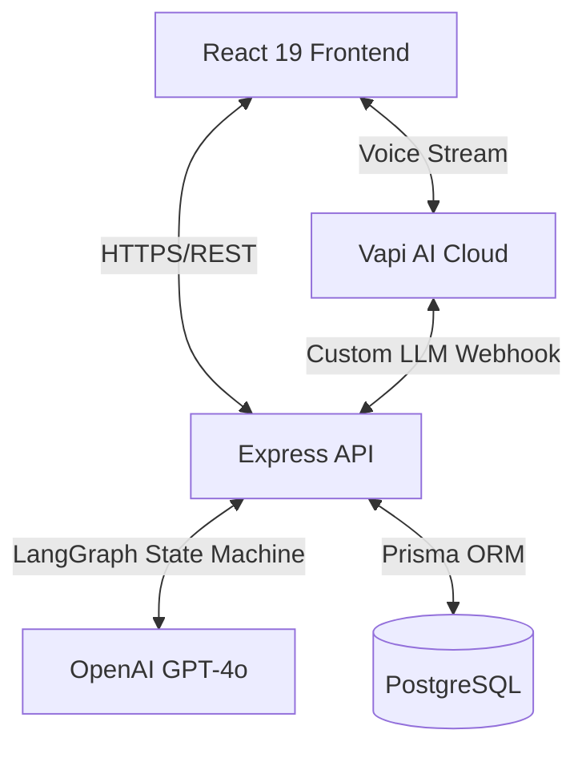

# AI Mock Interview Platform

A production-ready, full-stack web application where candidates have **natural, real-time voice conversations** with an AI interviewer. The AI dynamically generates questions from full conversation context, adapts difficulty based on candidate performance, and produces detailed feedback reports.

> **This is NOT a chatbot. This is NOT a quiz app.**
> Every question is generated from the entire conversation history. The AI reacts to your actual answers.

## Architecture & Technology Choices



### Why these technologies?
- **Vapi AI**: Chose Vapi for ultra-low latency conversational AI voice streaming. It handles Voice Activity Detection (VAD) and WebRTC better than building from scratch.
- **LangGraph (Custom LLM Endpoint)**: Vapi allows specifying a Custom LLM endpoint. We route the LLM decisions through our own backend powered by `LangGraph`. This gives us a state machine approach to track interview context, evaluate answers deeply, and systematically decide whether to challenge, follow-up, or move topics without relying on a single mega-prompt.
- **React 19 & Vite**: State-of-the-art frontend tooling. React 19 provides enhanced concurrency, and Vite provides instant HMR.
- **TanStack Query**: Perfect for server-state synchronization (interviews, reports). It simplifies loading/error states and optimistic updates.
- **Prisma + PostgreSQL**: Type-safe ORM with a robust relational database capable of handling complex JSON reports and interconnected user session data.

## Features

- **🎤 Real-time Voice Interview** — Full voice conversation with AI.
- **🧠 LangGraph Engine** — Conversation states are managed dynamically to evaluate and adapt.
- **🔄 Dynamic Question Generation** — Every question comes from conversation context, never a fixed list.
- **📊 Detailed Feedback Reports** — Scores, strengths, weaknesses, radar charts, hiring recommendation.
- **📈 Dashboard Analytics** — Score progression, interview history, streak tracking.
- **🔐 JWT Authentication** — Secure signup/login with refresh token rotation.
- **🌙 Dark Mode** — Full dark/light theme support.

## Folder Structure

```
├── client/                 # React frontend
│   └── src/
│       ├── components/     # UI components (layout, landing, dashboard, etc.)
│       ├── pages/          # Route pages
│       ├── hooks/          # Custom hooks (useVapi, useTimer, etc.)
│       ├── services/       # API client services
│       ├── context/        # Auth & Theme providers
│
├── server/                 # Express backend
│   └── src/
│       ├── controllers/    # Request handlers (including webhook)
│       ├── routes/         # API route definitions
│       ├── services/       # Business logic
│       │   └── conversation.service.ts # LangGraph engine
│       ├── middleware/     # Auth, validation, rate limiting
│       ├── prisma/         # Database schema
```

## Setup Instructions (Run locally in under 5 commands)

Make sure you have Docker and Node.js installed.

1. **Clone the repo and configure environment variables**
   ```bash
   git clone <repo> && cd AI-Mock-Platform
   cp .env.example .env && cp .env.example server/.env && echo "VITE_VAPI_PUBLIC_KEY=your-key" > client/.env
   ```
2. **Start the Database**
   ```bash
   docker-compose up -d
   ```
3. **Install Dependencies**
   ```bash
   cd server && npm install && cd ../client && npm install && cd ..
   ```
4. **Run Migrations & Start Servers concurrently**
   ```bash
   cd server && npx prisma migrate dev && npm run dev & cd client && npm run dev
   ```

## Deployment Instructions

| Service | Platform | Config |
|---------|----------|--------|
| Frontend | Vercel | Auto-detected from `client/` directory. |
| Backend | Railway / Render | Set `server/` as root directory. Start command: `npm run build && npm start`. |
| Database | Neon PostgreSQL | Free tier available. Provide the connection string as `DATABASE_URL`. |

> **Vapi Custom LLM**: If deploying to production, set `VAPI_CUSTOM_LLM_URL` in the server environment variables to point to `https://your-backend.com/api/webhook/llm`.

## Future Improvements & Trade-offs

- **Trade-off: WebRTC vs Custom LLM Latency**: Introducing LangGraph via a Custom LLM endpoint slightly increases latency compared to hitting OpenAI directly from Vapi's servers. However, this trade-off was explicitly chosen to drastically improve the *depth and quality* of the interview interaction loop.
- **Future Improvement: Persistent WebSocket**: Instead of standard HTTP webhooks, migrating the custom LLM endpoint to a WebSocket connection would reduce handshake latency for every turn of conversation.
- **Future Improvement: Live Code Execution**: Integrating a code execution environment (like Judge0) during the technical interview where the AI can "see" what the candidate is typing.
